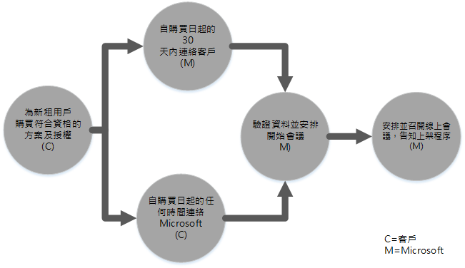
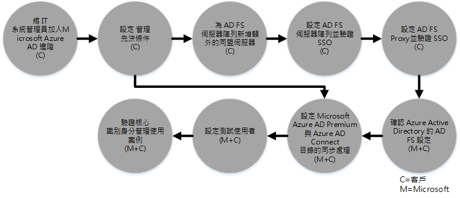

# 適用於 Azure Active Directory Premium 的 FastTrack Center 權益程序 
如果您的組織符合適用於 Microsoft Azure AD Premium 的 FastTrack Center 權益資格，您就可以從遠端和 Microsoft 專家合作，讓您的 Microsoft Azure AD Premium 環境可以就緒以供使用。 若要了解您的組織是否符合資格，請參閱 [適用於 Azure Active Directory Premium 的 FastTrack Center 權益](../Topic/FastTrack_Center_Benefit_for_Azure_Active_Directory_Premium.md)。

本文提供：

-   [Overview of the onboarding process](#overview)

-   [Expectations for your source environment](#expectations_src_environ)

-   [Phases of the onboarding process](#phases_onboarding_process)

-   每個階段 [Microsoft responsibilities](#microsoft_responsibilities)

-   每個階段[Your responsibilities](#your_responsibilities)

上架完成後的結果如下：

-   建立您的 Microsoft Azure AD Premium 租用戶。

-   授權的使用者將能使用下列身分識別選項之一存取 Microsoft Azure AD Premium 服務：

    -   雲端身分識別 (專用的 Microsoft Azure AD Premium 帳戶)。

    -   同步處理身分識別：使用 Azure Active Directory Connect (Azure AD Connect) 工具，為只有單一樹系或有多重 Active Directory 樹系的客戶，從您的內部部署 Active Directory 同步處理 Microsoft Azure AD Premium 帳戶。

    -   同盟身分識別 -- 與符合下列條件的 Microsoft Azure AD Premium 帳戶結為同盟：

        -   使用 Azure Active Directory Connect 工具，為只有一個 Active Directory 樹系組態的客戶，從 Active Directory 完成同步處理。

        -   從您的內部部署 Active Directory 與 Active Directory 同盟服務 (AD FS) 2.0 或更新版結為同盟。

## 上架程序概觀
上架程序包含兩個主要元件：

-   **核心功能** - 必要時設定租用戶及和 Azure AD 整合的工作。 核心功能也為其他符合資格的 Microsoft Online 服務提供上架的基準。

-   **服務上架** -- 設定獨立 Microsoft Azure AD Premium 所需的工作，或與 Azure AD 連接目錄同步處理或 AD FS。

下圖說明使用 FastTrack Center 權益的時間表。

基本程序如下：

-   Microsoft 會試圖在您購買合格方案起的 30 天內與您連絡。 如果您已經準備好為組織部署這些服務，您也可以要求 [FastTrack Center](http://fasttrack.microsoft.com/) 給予協助。 若要要求協助，請登入 FastTrack Center (http://fasttrack.microsoft.com)，移至儀表板，選取您的公司名稱，按一下 [優惠] 索引標籤，然後按一下合格服務的 [要求協助] 按鈕。 上架支援一經啟動，我們會隨即制定線上會議的時間表。

-   Microsoft 小組除將協助您核心功能的各項相關事宜之外，還會協助您將每項符合資格的服務上架一次。

所以上架支援會由指派的 Microsoft 人員從遠端完成：

-   Microsoft 會利用不同的工具、文件與指引的組合，協助您完成各種上架活動。 如需 Microsoft 為您完成某些設定工作，您可以選擇提供適當的存取權與權限給 Microsoft，由我們為您處理這些工作。

-   上架支援由 FastTrack 中心提供，而且只在指定地區的標準營業時間提供服務。

-   提供上架支援的語言包括繁體中文、英文、法文、德文、義大利文、日文、葡萄牙文 (巴西) 或西班牙文。

-   Microsoft 小組可直接與您或您的代表人員一起合作。

## 來源環境應具備的條件
您的來源環境中可能已有 Microsoft Active Directory 內部部署，而您想要將其與 Microsoft Azure AD Premium 相整合，以便能從單一主控台運用豐富的身分識別管理功能。 FastTrack Center 權益中有一項就是要協助您整合 Microsoft Azure AD Premium 與您現有的內部部署實作。 如有必要整合，您的來源環境至少須符合該應用程式的基本需求。

下表是待上架之既有環境應具備的條件。

|活動|來源環境應具備的條件|
|------|--------------|
|核心功能|功能樹系層級設定為 Windows Server 2008 (含) 以上，並具有下列樹系組態的 Active Directory 樹系：  -   單一 Active Directory 樹系 -   多個 Active Directory 樹系 **Note:** 對於所有多重樹系設定而言，AD FS 部署不屬於 FastTrack Center 權益的範圍。|
|服務上架  -   Microsoft Azure AD Premium|內部部署 Active Directory 及為 Azure AD premium 準備的環境，必須先修復找出的問題，以避免 Azure AD 與 Azure AD Premium 功能無法相互整合。|

## 上架程序的階段
Microsoft Azure AD Premium 上架工作包含五個主要階段，如下圖所示：

-   起始

-   評估

-   修復

-   啟用

-   關閉

如需每個階段工作的詳細資訊，請參閱 [Microsoft responsibilities](#microsoft_responsibilities)及[Your responsibilities](#your_responsibilities)小節。

### 起始階段
購買適當數目的授權之後，請遵循確認購買電子郵件中的指引，將授權與現有租用戶或新租用戶相關聯。 Microsoft 將會驗證您是否符合享有 FastTrack Center 權益的資格。 Microsoft 會試圖在您購買合格方案起的 30 天內與您連絡。 如果您已經準備好為組織部署這些服務，您也可以要求 [FastTrack Center](http://fasttrack.microsoft.com/) 給予協助。 若要要求協助，請登入 FastTrack Center (http://fasttrack.microsoft.com)，移至儀表板，選取您的公司名稱，按一下 [優惠] 索引標籤，然後按一下合格服務的 [要求協助] 按鈕。 上架支援一經啟動，我們會隨即制定線上會議的時間表。

在此階段中，我們會討論上架程序、確認資料，以及安排開始會議。

### 評估階段
上架程序開始時，Microsoft 會與您一起合作評估您的來源環境與需求。 期間將會執行工具評估您的環境，且 Microsoft 將會引導您完成評估您的內部部署 Active Directory、網際網路瀏覽器、用戶端裝置的作業系統、DNS、網路、基礎結構與身分識別系統，進而決定上架前是否需要任何變更。 我們會根據您目前的設定提供修復計劃，讓您的來源環境能夠達到在 Microsoft Azure AD Premium 順利上架的基本需求。 我們也會為修復階段設定適當的檢查點呼叫。

### 修復階段
如有需要，您將會在您的來源環境中執行修復計劃中的工作，以符合每項服務上架的要求。

啟用階段開始之前，我們將共同確認修復活動的結果，確保一切均已就緒，可以繼續後續工作。

### 啟用階段
當所有修復活動完成之後，專案會進入設定供服務使用之核心基礎結構，以及佈建 Microsoft Intune 的步驟。

**啟用階段 - 核心功能**

啟用核心功能包括服務佈建及租用戶與身分識別的整合。 這也包括為 Microsoft Azure AD Premium 上架建立基礎。

當核心上架完成之後，就可開始上線 Microsoft Azure AD Premium 的上架工作。

**啟用階段 - Microsoft Azure AD Premium**

Microsoft Azure AD Premium 環境可以視需要利用 Azure AD Connect 目錄同步作業與 Active Directory 同盟服務 (AD FS) 加以設定。

對於需要將內部部署身分識別同步處理到雲端的 Microsoft Azure AD Premium 案例，我們也會提供協助，包括將 IT 系統管理員與使用者加入您的訂用帳戶、設定管理必要條件、設定 Microsoft Azure AD Premium、設定使用 Azure AD Connect 執行目錄同步處理、使用 Azure AD Connect 的 Active Directory 同盟服務、設定測試使用者，以及驗證服務的核心使用狀況。

Microsoft Azure AD Premium 設定包括啟用下列功能：

-   自助密碼重設 (SSPR)

-   Azure Multi-Factor Authentication (MFA)

-   軟體即服務 (SaaS) 應用程式 - 設定一個 SaaS 應用程式

-   自助群組管理 (SSGM)

-   管理報告

## Microsoft 的責任

### 一般

-   從遠端協助您完成各階段詳細說明中所述的各項必要設定活動。

-   提供可用的文件、軟體工具、管理員主控台與指令碼，以協助您減少或免除設定工作。

您不需要將存取權和權限提供給 Microsoft，即可使用 FastTrack Center 權益。 在某些情況下，您可以選擇只提供 Microsoft 適當的存取權與權限來為您執行某些特定活動。

### 起始階段

-   在您購買新租用戶合格授權起的 30 天內連絡您。

-   在您購買合格授權起的 90 天內與您合作執行上架工作。

-   定義要上架的合格服務。

### 評估階段

-   提供系統管理概觀。

-   提供下列指引：

    -   DNS、網路與基礎結構的需求。

    -   用戶端需求 (網際網路瀏覽器、用戶端作業系統與服務的需求)。

    -   使用者識別身分與佈建。

    -   指出目錄同步處理需求。

    -   判斷密碼雜湊同步處理是否符合客戶目標，或是否需要 AD FS。

    -   啟用所購買並定義為上架項目的合格服務。

    -   確認所需的試驗與測試環境需求，例如測試帳戶、SaaS 應用程式 (例如 SalesForce) 的測試執行個體。

-   建立修復活動的時間表。

-   提供修復檢查清單。

### 修復階段

-   依據雙方同意的時間表一同召開電話會議，以審核修復活動的進度。

-   協助執行工具，指出並修復問題，同時解譯結果。

### 啟用階段
提供下列指引：

-   啟用您的 Microsoft Azure AD Premium 租用戶。

-   設定防火牆連接埠。

-   設定合格服務的 DNS。

-   確認能夠連線到 Microsoft Azure AD Premium 服務。

-   對於單一樹系的環境：

    -   必要時，在您的 Active Directory 網域服務 (AD DS) 與 Azure AD Connect 之間安裝安裝目錄同步處理。

    -   使用 Azure AD Connect 工具設定密碼同步處理。

-   對於具有多個樹系的環境：

    -   安裝 Azure AD Connect 同步處理，並就多個樹系案例進行設定。 請注意，密碼雜湊同步及密碼回寫可支援多個樹系，  但不支援其他的回寫情況。

    -   設定內部部署 Active Directory 樹系與 Microsoft Azure AD Premium 目錄 (Azure Active Directory) 之間的同步處理。

        > [!NOTE]
        > 開發及實作自訂規則延伸不在此範圍內。

-   對於目標是同盟身分識別的單一樹系：如有必要，請在單一站台的容錯設定中，為 Microsoft Azure AD Premium 的本機網域驗證，安裝及設定 Active Directory 同盟服務 (AD FS)。

    > [!NOTE]
    > 對於所有具有多個樹系的組態而言，AD FS 部署不在範圍內。

-   如有部署單一登入 (SSO) 功能，請加以測試。

#### 啟用階段 - Azure AD Premium -- 使用 Azure AD Connect 與 AD FS
提供設定的指引：

-   使用者佈建 (包括授權)。

-   Azure AD Connect 目錄同步處理 (使用密碼回寫與密碼雜湊同步處理)。

-   Active Directory 同盟服務 (AD FS)

-   自助密碼重設 (SSPR)。

-   Azure Multi-Factor Authentication (MFA)。

-   一個整合式應用程式，其中包含 SaaS 應用程式的單一登入。

-   提供使用量與安全性報告給系統管理員。

-   自助群組管理 (SSGM)。

-   應用程式 Proxy。

-   系統管理員通知。

-   自訂的登入畫面，包括商標、文字及影像。

## 您的責任
本節說明上架程序期間您的責任。

### 一般

-   任何超出本文所列之可設定選項範圍的 Microsoft Azure AD Premium 服務租用戶增強功能與整合。

-   您資源的整體程式及專案管理。

-   使用者通訊、文件、訓練及變更管理。

-   技術服務人員文件及訓練。

-   產生您組織專用的報告、簡報或會議記錄。

-   建立您組織專用的架構及技術文件。

-   設計、採購、安裝及設定硬體與網路。

-   採購、安裝及設定軟體。

-   管理、 設定及套用不是為測試 Microsoft Azure AD Premium 服務基準組態及功能而建立的安全性原則。

-   註冊不是用於測試 Microsoft Azure AD Premium 服務基準設定及功能的使用者帳戶。

-   網路設定、分析、頻寬驗證、測試及監視。

-   管理技術變更的管理核准程序，並建立支援文件。

-   修改操作模型及作業指南。

-   設定內部部署的多重要素驗證。

-   解除委任及移除客戶先前使用的來源環境與服務。

-   建構及維護您的測試環境。

-   在基礎結構伺服器上安裝 Service Pack 及其他必要的更新。

-   提供及設定任何公開 SSL 憑證。

-   撰寫要在使用者所擁有之裝置上設定及部署的組織使用規定 (TOU) 聲明。

### 起始階段

-   與 Microsoft 小組一起合作開始將符合資格的服務上架。

-   參與合作開始會議、管理及帶領組織內的參與者，並確認修復時間表。

### 評估階段

-   指定適當的專案關係人 (包括專案經理)，以完成必要的評估活動。

-   若您願意，可以在對環境或您的 Microsoft Azure AD Premium 訂用帳戶執行評估工具需要指引時，將您的畫面提供給 Microsoft 共用。

-   參與會議制定修復檢查清單，並對整體計劃中的各項主題 (包括準備基礎結構、網路、管理、目錄同步處理、網路安全性及同盟識別身分) 提供意見。

-   參與會議概述使用者佈建方法。

-   參與會議規劃線上服務組態。

-   建立移轉整備的支援計劃。

### 修復階段

-   執行必要步驟，以完成「評估」階段中所指定的修復活動。

-   參與檢查點會議。

### 啟用階段

-   若您願意，您可以在變更您的環境或您的 Microsoft Azure AD Premium 訂用帳戶時，將您的畫面提供給 Microsoft 共用。

-   視需要管理資源。

-   遵循 Microsoft 指引，設定網路相關項目。

-   遵循 Microsoft 指引，執行目錄整備及設定目錄同步處理。

-   遵循 Microsoft 指引，設定安全性相關的基礎結構 (例如防火牆連接埠)。

-   實作適當的用戶端基礎結構。

-   遵循 Microsoft 指引，實作使用者佈建方法。

-   遵循 Microsoft 指引，啟用各種服務。

## 想要了解更多嗎？
請參閱 [Microsoft Azure Active Directory](http://azure.microsoft.com/en-us/documentation/services/active-directory/) 及 [Enterprise Mobility Suite](http://www.microsoft.com/en-us/server-cloud/products/enterprise-mobility-suite/default.aspx)。

