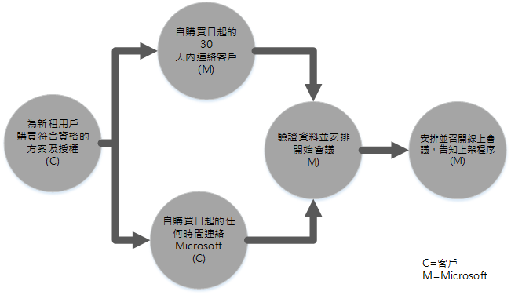
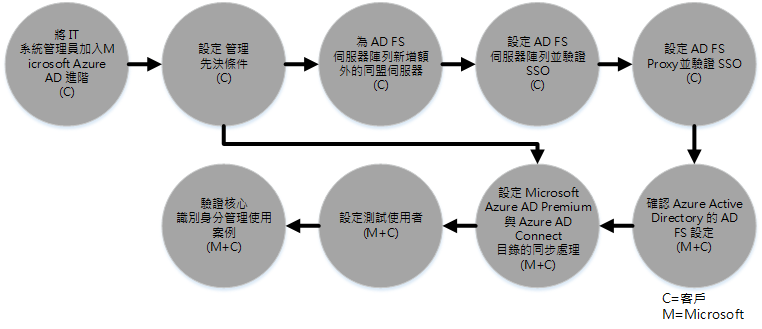

# Azure 版權管理的 FastTrack Center 權益程序
如果您的組織符合適用於 Microsoft Azure 版權管理的 FastTrack Center 權益資格，即可從遠端與 Microsoft 專家合作，讓您的 Azure RMS 環境可以就緒供使用。 如需了解您的組織是否符合資格，請參閱[Azure 版權管理的 FastTrack Center 權益](../Topic/FastTrack_Center_Benefit_for_Azure_Rights_Management.md)。

本文提供：

-   [Overview of the onboarding process](#overview_rms)

-   [Expectations for your source environment](#expectations_src_environ_rms)

-   [Phases of the onboarding process](#phases_onboarding_process_rms)

-   每個階段的 [Microsoft responsibilities](#microsoft_responsibilities_rms)

-   每個階段的 [Your responsibilities](#your_responsibilities_rms)

上架完成後的結果如下：

-   已建立好您的 Microsoft Azure RMS 租用戶。

-   授權的使用者可以使用下列身分識別選項之一，存取 Azure RMS 服務：

    -   雲端身分識別 (專用的 Microsoft Azure AD 帳戶)。

    -   同步身分識別：使用 Azure Active Directory Connect (Azure AD Connect) 工具，為只有單一樹系或有多重 Active Directory 樹系的客戶，從您的內部部署 Active Directory 同步處理 Microsoft Azure AD 帳戶。

    -   同盟身分識別 -- 與符合下列條件的 Microsoft Azure AD 帳戶結為同盟：

        -   使用 Azure Active Directory Connect 工具，為只有一個 Active Directory 樹系組態的客戶，從 Active Directory 完成同步處理。

        -   從您的內部部署 Active Directory 與 Active Directory 同盟服務 (AD FS) 2.0 或更新版結為同盟。

## 上架程序概觀
上架程序包含兩個主要元件：

-   **核心功能** - 必要時設定租用戶及和 Azure AD 整合的工作。 核心功能也提供將其他 Microsoft Online 符合條件的服務上架之基準。

-   **服務上架** -- 設定獨立 Azure RMS 所需的工作，或與 Azure AD Connect 目錄同步處理或 AD FS。

下圖說明使用 FastTrack Center 權益的時間表。

基本程序如下：

-   Microsoft 會試圖在您購買合格方案起的 30 天內與您連絡。 如果您已經準備好為組織部署這些服務，您也可以要求 [FastTrack Center](http://fasttrack.microsoft.com/) 給予協助。 若要要求協助，請登入 FastTrack Center (http://fasttrack.microsoft.com)，移至儀表板，選取您的公司名稱，按一下 [優惠] 索引標籤，然後按一下合格服務的 [要求協助] 按鈕。

-   Microsoft 小組將協助您核心功能的各項相關事宜，且之後將協助您將每項合格服務上架一次。

所以上架支援會由指派的 Microsoft 人員從遠端完成：

-   Microsoft 會利用不同的工具、文件與指引的組合，協助您完成各種上架活動。 如需 Microsoft 為您完成某些設定工作，您可以選擇提供適當的存取權與權限給 Microsoft，由我們為您處理這些工作。

-   上架支援由 FastTrack Center 提供，而且只在指定地區的標準營業時間提供服務。

-   提供上架支援的語言包括繁體中文、英文、法文、德文、義大利文、日文、葡萄牙文 (巴西) 或西班牙文。

-   Microsoft 小組可直接與您或您指定的代表一起合作。

## 來源環境應具備的條件
您的來源環境中可能已有 Microsoft Active Directory 內部部署，而您想要將其與 Microsoft Azure Active Directory 相整合，以便能從單一主控台運用豐富的身分識別管理功能。 FastTrack Center 權益中有一項就是會協助您整合 Microsoft Azure Active Directory 與現有的內部部署實作。 如有必要整合，您的來源環境至少須符合該應用程式的基本需求。

下表是待上架之既有環境應具備的條件。

|活動|來源環境應具備的條件|
|------|--------------|
|核心功能|功能樹系層級設定為 Windows Server 2008 (含) 以上，並具有下列樹系組態的 Active Directory 樹系：  -   單一 Active Directory 樹系 -   多個 Active Directory 樹系 **Note:** 對於所有多重樹系的組態而言，AD FS 部署不屬於 FastTrack Center 權益的範圍。|
|服務上架  -   Azure RMS|內部部署 Active Directory 以及為 Azure RMS 準備的環境，內含會讓 Azure AD 與 Azure RMS 功能無法整合的身分識別問題補救。|

## 上架程序的階段
Azure RMS 上架工作包含五個主要階段，如下圖所示：

-   起始

-   評估

-   修復

-   啟用

-   關閉

如需了解每個階段的詳細工作內容，請參閱[Microsoft responsibilities](#microsoft_responsibilities_rms)與[Your responsibilities](#your_responsibilities_rms)小節。

### 起始階段
購買適當數目的授權之後，請遵循確認購買電子郵件中的指示，將授權與現有租用戶或新租用戶相關聯。 Microsoft 將會驗證您是否符合享有 FastTrack Center 的資格。 Microsoft 會試圖在您購買合格方案起的 30 天內與您連絡。 如果您已經準備好為組織部署這些服務，您也可以要求 [FastTrack Center](http://fasttrack.microsoft.com/) 給予協助。 若要要求協助，請登入 FastTrack Center (http://fasttrack.microsoft.com)，移至儀表板，選取您的公司名稱，按一下 [優惠] 索引標籤，然後按一下合格服務的 [要求協助] 按鈕。

在此階段中，我們會討論上架程序、確認資料，以及安排開始會議。

### 評估階段
上架程序開始時，Microsoft 會與您一起合作評估您的來源環境與需求。 期間將會執行工具評估您的環境，且 Microsoft 將會引導您完成評估您的內部部署 Active Directory、網際網路瀏覽器、用戶端裝置的作業系統、DNS、網路、基礎結構與身分識別系統，進而決定上架前是否需要任何變更。 我們會根據目前的設定，提供補救計劃，讓您的來源環境能夠達到在 Azure RMS 成功上架的最低需求。 我們也會為修復階段設定適當的檢查點呼叫。

### 修復階段
如有需要，您將會在您的來源環境中執行修復計劃中的工作，以符合每項服務上架的要求。

啟用階段開始之前，我們將共同確認修復活動的結果，確保一切均已就緒，可以繼續後續工作。

### 啟用階段
當所有補救活動均完成之後，專案會進入服務取用的核心基礎結構設定，以佈建 Azure RMS。

**啟用階段 - 核心功能**

啟用核心功能包括服務佈建及租用戶與身分識別的整合。 這也包括提供 Microsoft Azure RMS 上架基礎的步驟。

當核心上架完成之後，便可開始 Azure RMS 上架。

**啟用階段 – Azure RMS**

Azure RMS 環境可以視需要利用 Azure AD Connect 目錄同步處理與 Active Directory 同盟服務 (AD FS) 加以設定。

對於需要將內部部署身分識別同步處理到雲端的 Azure RMS 案例，我們也會提供協助，包括將 IT 系統管理員與使用者加入您的訂用帳戶、設定管理必要條件、設定 Azure RMS、設定使用 Azure AD Connect 的目錄同步處理、使用 Azure AD Connect 的 Active Directory 同盟服務、設定測試使用者，以及驗證該服務的核心使用狀況。

Azure RMS 設定包括啟用下列功能：

-   RMS 服務啟用

-   適用於 Exchange Online 與 Sharepoint Online 的 IRM 組態

-   具備 Exchange 內部部署與 Sharepoint 內部部署的 Rights Management 連接器

-   適用於 Windows 及非 Windows 裝置的 RMS 共用應用程式

## Microsoft 的責任

### 一般

-   從遠端協助您完成各階段詳細說明中所述的各項必要設定活動。

-   提供可用的文件、軟體工具、管理員主控台與指令碼，以協助您減少或免除設定工作。

將存取權及權限提供給 Microsoft 無須使用 FastTrack Center 上架權益。 在某些情況下，您可以選擇只提供 Microsoft 適當的存取權與權限來為您執行某些特定活動。

### 起始階段

-   在您購買新租用戶合格授權起的 30 天內連絡您。

-   定義要上架的合格服務。

### 評估階段

-   提供系統管理概觀。

-   提供下列指引：

    -   DNS、網路與基礎結構的需求。

    -   用戶端需求 (網際網路瀏覽器、用戶端作業系統與服務的需求)。

    -   使用者識別身分與佈建。

    -   指出目錄同步處理需求。

    -   啟用所購買且定義為上架項目之一部分的合格服務。

    -   識別所需的試驗及測試環境需求。

-   建立修復活動的時間表。

-   提供修復檢查清單。

### 修復階段

-   依據雙方同意的時間表一同召開電話會議，以審核修復活動的進度。

-   協助執行工具，指出並修復問題，同時解譯結果。

### 啟用階段
提供下列指引：

-   啟動您的 Azure RMS 租用戶。

-   設定防火牆連接埠。

-   設定合格服務的 DNS。

-   正在驗證對 Azure RMS 服務的連線能力。

-   對於單一樹系的環境：

    -   必要時，在您的 Active Directory 網域服務 (AD DS) 與 Azure AD Connect 之間安裝安裝目錄同步處理。

    -   使用 Azure AD Connect 工具設定密碼同步處理。

-   對於具有多個樹系的環境：

    -   安裝 Azure AD Connect 同步處理，並就多重樹系案例進行設定。 請注意，密碼雜湊同步及密碼回寫可支援多個樹系，  但不支援其他的回寫情況。

    -   設定內部部署 Active Directory 樹系與 Microsoft Azure AD 目錄 (Azure Active Directory) 之間的同步處理。

        > [!NOTE]
        > 開發及實作自訂規則延伸不在此範圍內。

-   對於目標是同盟身分識別的單一樹系：如有必要，請在單一站台的容錯組態中，為 Microsoft Azure AD 的本機網域驗證，安裝及設定 Active Directory 同盟服務 (AD FS)。

    > [!NOTE]
    > 對於所有具有多個樹系的組態而言，AD FS 部署不在範圍內。

-   如有部署單一登入 (SSO) 功能，請加以測試。

-   新增其他資訊安全性系統管理員，來管理範本。

-   為 Azure RMS 指派進階使用者帳戶。

-   為 Azure RMS 授權兩位試驗使用者。

-   設定兩個測試通訊群組來驗證原則。

-   為您的目錄設定一個自訂 Azure RMS 範本。

-   提供設定 SharePoint Online 以及 Azure RMS 與 Exchange Online 整合所需的指導，包括：

    -   設定及驗證 Exchange Online 與 Azure RMS 的整合。

    -   設定一個測試郵件流程規則，來加傳送給組織外部收件者的機密訊息。

    -   設定及驗證要用 Azure RMS 保護的其中一個測試程式庫的 SharePoint Online 保護。

-   設定一部具有 RMS 連接器的伺服器內部部署 (若適用)：

    -   設定及驗證 Exchange 2013/2010 內部部署與 Azure RMS 的整合。

    -   設定一個測試郵件流程規則，來加傳送給使用連接器的組織外部收件者的機密訊息。

    -   設定及驗證要用 Azure RMS 保護的其中一個測試程式庫之 SharePoint 2013/2010 內部部署保護。

-   設定適用於 Windows 及非 Windows 裝置的 RMS 共用應用程式。

## 您的責任
本節說明上架程序期間您的責任。

### 一般

-   任何超出本文所列之可設定選項範圍的 Azure RMS 租用戶之增強功能與整合。

-   您資源的整體程式及專案管理。

-   使用者通訊、文件、訓練及變更管理。

-   技術服務人員文件及訓練。

-   產生您組織專用的報告、簡報或會議記錄。

-   建立您組織專用的架構及技術文件。

-   設計、採購、安裝及設定硬體與網路。

-   採購、安裝及設定軟體。

-   管理、設定及套用不是為測試 Azure RMS 服務基準組態及功能所建立的安全性原則。

-   註冊不是用於測試 Azure RMS 服務基準組態及功能的使用者帳戶。

-   網路設定、分析、頻寬驗證、測試及監視。

-   管理技術變更的管理核准程序，並建立支援文件。

-   修改操作模型及作業指南。

-   解除委任及移除客戶先前使用的來源環境與服務。

-   建構及維護您的測試環境。

-   在基礎結構伺服器上安裝 Service Pack 及其他必要的更新。

-   提供及設定任何公開 SSL 憑證。

-   撰寫要在使用者所擁有之裝置上設定及部署的組織使用規定 (TOU) 聲明。

### 起始階段

-   與 Microsoft 小組一起合作開始上線合格的服務。

-   參與合作開始會議、管理及帶領組織內的參與者，並確認修復時間表。

### 評估階段

-   指定適當的專案關係人 (包括專案經理)，以完成必要的評估活動。

-   在對您的環境或您的 Azure RMS 訂閱執行評估工具時如需協助，也可選擇將您的畫面提供給 Microsoft。

-   參與會議制定修復檢查清單，並對整體計劃中的各項主題 (包括準備基礎結構、網路、管理、目錄同步處理、網路安全性及同盟識別身分) 提供意見。

-   參與會議概述使用者佈建方法。

-   參與會議規劃線上服務組態。

-   建立移轉整備的支援計劃。

### 修復階段

-   執行必要步驟，以完成「評估」階段中所指定的修復活動。

-   參與檢查點會議。

### 啟用階段

-   在對您的環境或您的 Azure RMS 訂閱執行評估工具時如需協助，也可選擇將您的畫面提供給 Microsoft。

-   視需要管理資源。

-   遵循 Microsoft 指引，設定網路相關項目。

-   遵循 Microsoft 指引，執行目錄整備及設定目錄同步處理。

-   遵循 Microsoft 指引，設定安全性相關的基礎結構 (例如防火牆連接埠)。

-   實作適當的用戶端基礎結構。

-   遵循 Microsoft 指引，實作使用者佈建方法。

-   遵循 Microsoft 指引，啟用各種服務。

## 想要了解更多嗎？
請參閱 [Microsoft Azure Rights Management](http://products.office.com/business/microsoft-azure-rights-management) 與 [Enterprise Mobility Suite](http://www.microsoft.com/en-us/server-cloud/products/enterprise-mobility-suite/default.aspx)。

